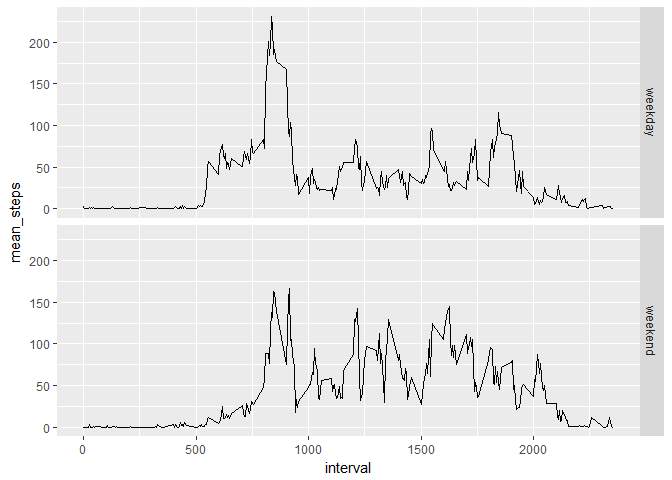

# Reproducible Research: Peer Assessment 1


## Loading and preprocessing the data

Load libraries and data.

```r
setwd("d:/Disk Google/Coursera/c5w2")
act_data <- read.csv("activity.csv")
library(dplyr)
```

```
## 
## Attaching package: 'dplyr'
```

```
## The following objects are masked from 'package:stats':
## 
##     filter, lag
```

```
## The following objects are masked from 'package:base':
## 
##     intersect, setdiff, setequal, union
```

```r
library(ggplot2)
```


Computation of mean, median and total steps per day.

```r
steps_summary <- summarise(group_by(act_data, date),
                  mean_steps = mean(steps,na.rm = TRUE),
                  median_steps = median(steps,na.rm = TRUE),
                  total_steps = sum(steps)
                  )
```


Computation of mean per time interval.

```r
#steps_summary[is.na(steps_summary)] <- 0

interval_summary <- summarise(group_by(act_data, interval),
                           mean_steps = mean(steps,na.rm = TRUE)
)
```


## What is mean total number of steps taken per day?
Histogram of the total number of steps taken each day.

```r
hist(steps_summary$total_steps, xlab = "Number of steps", main  = "Histogram of daily steps")
```

<!-- -->

Mean and median of the total number of steps taken per day.

```r
mean(steps_summary$total_steps, na.rm = TRUE)
```

```
## [1] 10766.19
```

```r
median(steps_summary$total_steps , na.rm = TRUE)
```

```
## [1] 10765
```

## What is the average daily activity pattern?
Average number of steps taken, averaged across all days grouped by interval.

```r
ggplot(interval_summary, aes(x=interval, y=mean_steps)) + geom_line()
```

<!-- -->

Interval containing on average across all the days in the dataset, the maximum number of steps

```r
interval_summary[which.max(interval_summary$mean_steps),]
```

```
## # A tibble: 1 × 2
##   interval mean_steps
##      <int>      <dbl>
## 1      835   206.1698
```

## Imputing missing values
Total number of missing values in the dataset.

```r
sum(is.na(act_data$steps))
```

```
## [1] 2304
```

We will correct NA values by replacing them with means of the interval accros all the days.
Correction of NAs with means of intervals is following:

```r
corr_data <- select(merge(act_data,interval_summary), steps, mean_steps , date, interval)
corr_data$steps <-ifelse( is.na(corr_data$steps),corr_data$mean_steps,corr_data$steps)

# final data 
corr_data <- select(corr_data, steps, date, interval)

steps_summary_corr <- summarise(group_by(corr_data, date),
                                mean_steps = mean(steps,na.rm = TRUE),
                                median_steps = median(steps,na.rm = TRUE),
                                total_steps = sum(steps)
)
```


Histogram of the total number of steps taken each day:

```r
hist(steps_summary_corr$total_steps, xlab = "Number of steps", main  = "Histogram of daily steps (after NA correction)")
```

<!-- -->

## Are there differences in activity patterns between weekdays and weekends?

First lets add day number to corrected dataset and part of the week

```r
corr_data$day_nbr <- strftime(corr_data$date,"%u")
corr_data$week_part <- ifelse(corr_data$day_nbr %in% c(6,7), "weekend","weekday")

steps_wd_summary_corr <- summarise(group_by(corr_data, week_part, interval),
                                mean_steps = mean(steps,na.rm = TRUE)
)
```

Plot containing a time series plot of the 5-minute interval and the average number of steps taken, averaged across all weekday days or weekend days.

```r
qplot(data = steps_wd_summary_corr, 
      x = interval,
      y = mean_steps,
      facets = week_part ~ .,
      geom = "line")
```

<!-- -->
